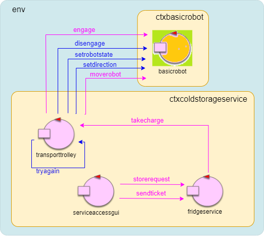
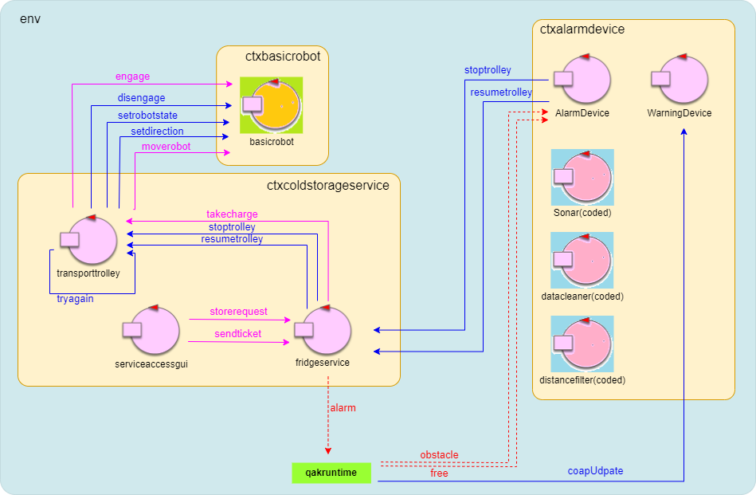
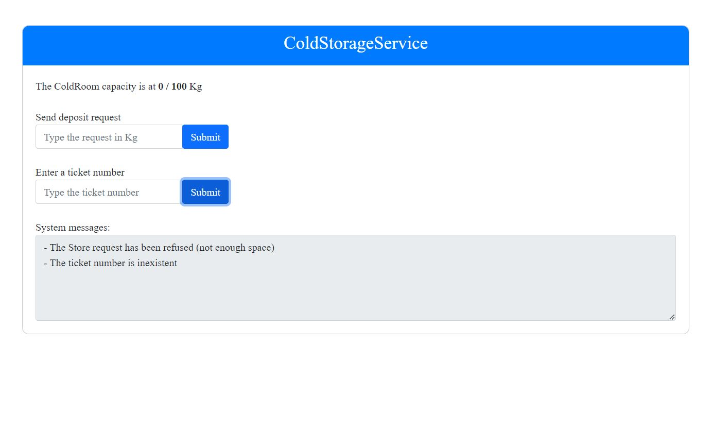
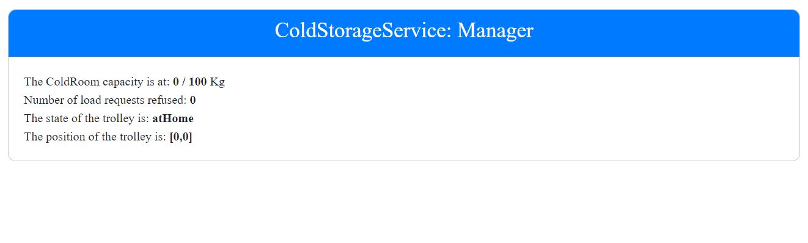

# Distributed Application for a Storage Service
This project was made for the exam of Software Systems Engineering at University of Bologna.
It involves the development of a distributed application for the management of a fictitious storage service by following the Agile metodology and SOLID principles.

The task of this project can be found [here](html/TemaFinale23.html).

The development of the system has been devided in 4 sprints (plus an intruductive one).

## Sprint 0
Requirements analysis ,subdivision of the project in different components, a first model for the system and work plan.
Sprint 0 can be found [here](Sprint0/Sprint0v2.html).

## Sprint 1
Development of the core business of the system.

Sprint 1 can be found [here](Sprint1/Sprint1.html).

## Sprint 2
Development of a distributed application in a raspberry PI for the alarm requirements of the task.

Sprint 2 can be found [here](Sprint2/Sprint2.html).

## Sprint 3
Development of a simple web application for accessing the system.

Sprint 3 can be found [here](Sprint3/Sprint3.html).

## Sprint 4
Finalizing the project with the development of a simple web application for the system manager.

Sprint 4 can be found [here](Sprint4/Sprint4.html).
